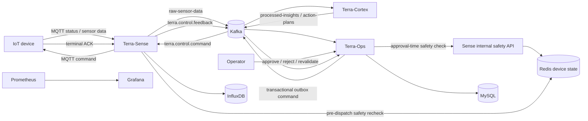

# TerraNeuron Smart Farm Platform


이벤트 기반 스마트팜 제어 흐름을 검증하는 **production-oriented architecture prototype**입니다.

> **Repository status — 2026-07-20**
>
> TerraNeuron은 로컬 Docker Compose에서 핵심 neural-flow 통합 경로를 검증하고, 집중 서비스 테스트에서 인간 승인, 명령 전송, 디바이스 피드백과 안전 차단 동작을 검증합니다. 보안·신뢰성 패턴은 코드와 CI에서 강제되지만, 실제 운영 배포와 물리 장비 안전을 완료한 제품은 아닙니다.

현재 구현 상태의 단일 기준 문서는 [`STATUS.md`](STATUS.md)입니다.

## Architecture


```mermaid
flowchart LR
    Device[IoT device] -->|MQTT status / sensor data| Sense[Terra-Sense]
    Sense -->|raw-sensor-data| Kafka[(Kafka)]
    Kafka --> Cortex[Terra-Cortex]
    Cortex -->|processed-insights / action-plans| Kafka
    Kafka --> Ops[Terra-Ops]
    Operator[Operator] -->|approve / reject / revalidate| Ops

    Ops -->|approval-time safety check| SenseSafety[Sense internal safety API]
    SenseSafety --> Redis[(Redis device state)]
    Ops -->|transactional outbox command| Kafka
    Kafka -->|terra.control.command| Sense
    Sense -->|pre-dispatch safety recheck| Redis
    Sense -->|MQTT command| Device
    Device -->|terminal ACK| Sense
    Sense -->|terra.control.feedback| Kafka
    Kafka --> Ops

    Sense --> Influx[(InfluxDB)]
    Ops --> MySQL[(MySQL)]
    Prometheus[Prometheus] --> Grafana[Grafana]
```

## Services

| Service | Role | Default port |
|---|---|---:|
| `terra-gateway` | API gateway and Redis-backed rate limiting | 8000 |
| `terra-sense` | HTTP/MQTT ingestion, device-state registry, command dispatch and ACK forwarding | 8081 |
| `terra-cortex` | rule-based and optional LLM/RAG analysis | 8082 |
| `terra-ops` | authentication, action-plan lifecycle, approval, outbox and audit API | 8080 |
| `terra-dashboard` | operator dashboard shell; protected Ops API authentication propagation is not yet complete | 3001 |
| `terra-data-collector` | optional external data collector profile | 8083 |

Infrastructure includes Kafka/Zookeeper, MySQL, InfluxDB, Redis, Mosquitto, Prometheus and Grafana.

## Enforced capabilities

### Contracts and event processing

- CloudEvents-based canonical contracts with runtime JSON Schema validation.
- Bounded Kafka retry and dead-letter handling.
- Stable Cortex `eventId` generation and durable semantic deduplication.
- Kafka transactional publication for Cortex processing.
- Terra-Ops transactional outbox with one command row per action plan.
- Command delivery, physical ACK correlation, timeout handling and duplicate suppression.

### Security

- MySQL-backed interactive users with BCrypt password verification.
- JWT access/refresh token type separation and RBAC-protected APIs.
- Separate service JWT boundaries for Cortex → Ops and Ops → Sense.
- Explicit CORS origin configuration and Redis-backed gateway rate limiting.
- Trivy SARIF reporting plus CI failure for fixable HIGH/CRITICAL dependency vulnerabilities.

### Device Safety Gate

Physical device actions are checked twice:

1. **Approval time:** Terra-Ops calls the authenticated Terra-Sense safety API. Unsafe plans become `SAFETY_BLOCKED` and receive no command ID or outbox row.
2. **Immediately before MQTT dispatch:** Terra-Sense evaluates the same Redis-backed state and capability policy again. A blocked command emits correlated terminal feedback without calling MQTT.

The gate fails closed for missing, stale, offline, error, maintenance, incompatible or unsupported device state. The exact non-actuating `alert` / `alert_only` pair does not require physical device state.

See [`docs/DEVICE_SAFETY_GATE.md`](docs/DEVICE_SAFETY_GATE.md).

### Database and observability

- Flyway owns the Terra-Ops schema; Hibernate runs in validation mode.
- Legacy schema and command-outbox states are reconciled through forward migrations.
- Prometheus metrics and bounded reliability alerts avoid raw identifiers and payload labels.
- Grafana dashboards are provisioned through the repository.

## Local execution

```bash
git clone https://github.com/joeylife94/terraneuron-smartfarm-platform.git
cd terraneuron-smartfarm-platform
cp .env.example .env
```

Before starting, replace the local placeholders for:

- `JWT_SECRET`
- `SERVICE_AUTH_JWT_SECRET`
- `DEVICE_SAFETY_JWT_SECRET`
- `REDIS_PASSWORD`

Then run:

```bash
docker compose up -d
docker compose ps
```

The Compose stack is a development and integration environment. Default database, broker and monitoring credentials must not be reused outside local testing.

## Validation

The active GitHub Actions pipeline verifies:

- Terra-Sense and Terra-Ops Gradle builds and tests;
- Terra-Cortex dependency installation, lint and tests;
- Terra-Dashboard production build;
- dependency vulnerability policy;
- Prometheus configuration and rule tests;
- Docker Compose startup and neural-flow integration.

Command lifecycle, safety revalidation, MQTT dispatch and ACK behavior are covered by focused service tests rather than the current Compose E2E script.

## Operational boundaries

TerraNeuron is not yet a production deployment. Remaining boundaries include:

- dashboard propagation of interactive authentication to protected Terra-Ops APIs;
- MQTT client authentication, authorization and TLS;
- physical interlocks, emergency stops and local controller limits;
- manufacturer/model-specific capability adapters;
- refresh-token persistence, rotation and individual revocation;
- account administration, MFA and password-reset workflows;
- production secrets management and key rotation;
- highly available Kafka, Redis, MySQL, InfluxDB and monitoring infrastructure;
- production deployment manifests, load testing and fault-injection evidence.

Device-reported state is an application signal, not proof of physical equipment state.

## Documentation

- [`STATUS.md`](STATUS.md) — verified implementation status and remaining gaps
- [`docs/DEVICE_SAFETY_GATE.md`](docs/DEVICE_SAFETY_GATE.md) — two-stage device safety policy
- [`docs/ACTION_PROTOCOL.md`](docs/ACTION_PROTOCOL.md) — action and command protocol
- [`docs/TERRA_OPS_SCHEMA_MIGRATIONS.md`](docs/TERRA_OPS_SCHEMA_MIGRATIONS.md) — database ownership and rollout
- [`docs/SECURITY_SCANNING.md`](docs/SECURITY_SCANNING.md) — dependency scan enforcement
- [`AUDIT_REPORT.md`](AUDIT_REPORT.md) — retired historical audit pointer
