# 🌿 TerraNeuron Smart Farm Platform


**신경망처럼 연결된 지능형 스마트팜 MSA 플랫폼**

> **✅ Production-Validated (December 8, 2025)**  
> 25 insights processed | 100% success rate | AI anomaly detection confirmed | 0% data loss

---

## 🧠 아키텍처 개요

TerraNeuron은 인간의 신경계를 모방한 3개의 마이크로서비스로 구성됩니다:

```mermaid
graph TD
    subgraph Edge["IoT Edge Layer"]
        Sensor[🌱 IoT Sensor] -->|MQTT/HTTP| Mosquitto[Mosquitto Broker]
    end

    subgraph Core["TerraNeuron Microservices"]
        Mosquitto -->|Raw Data| Sense[📡 terra-sense]
        Sense -->|Push| Kafka1[(Kafka: raw-sensor-data)]
        Kafka1 -->|Consume| Cortex[🧠 terra-cortex]
        Cortex -->|AI Inference| Kafka2[(Kafka: processed-insights)]
        Kafka2 -->|Consume| Ops[🎮 terra-ops]
    end

    subgraph Data["Data Layer - Persistence"]
        Sense -->|Write| Influx[(InfluxDB)]
        Ops -->|Read/Write| MySQL[(MySQL)]
    end

    Ops -->|API| Dash[📊 User Dashboard]
```



### 🔬 서비스 구성

#### 1. **terra-sense** (감각 신경 - IoT Ingestion)
- **기술**: Java 17+, Spring Boot 3
- **역할**: IoT 센서 데이터 수집 (MQTT/HTTP)
- **출력**: Kafka Topic `raw-sensor-data`

#### 2. **terra-cortex** (대뇌 피질 - AI Brain)
- **기술**: Python 3.10+, FastAPI, PyTorch
- **역할**: AI 기반 이상 탐지 및 분석
- **입력**: Kafka Topic `raw-sensor-data`
- **출력**: Kafka Topic `processed-insights`

#### 3. **terra-ops** (운영 통제 - Farm Management)
- **기술**: Java 17+, Spring Boot 3, MySQL JPA
- **역할**: 비즈니스 로직 처리 및 Dashboard API 제공
- **입력**: Kafka Topic `processed-insights`

## 🚀 빠른 시작

### 전체 시스템 실행
```bash
docker-compose up -d
```

### 개별 서비스 개발
```bash
# terra-sense (Java)
cd services/terra-sense
./gradlew bootRun

# terra-cortex (Python)
cd services/terra-cortex
pip install -r requirements.txt
uvicorn src.main:app --reload

# terra-ops (Java)
cd services/terra-ops
./gradlew bootRun
```

## 📚 API Documentation

시스템 실행 후 아래 주소에서 대화형 API 문서를 확인할 수 있습니다:

| 서비스 | Swagger/Docs URL | 설명 |
|--------|------------------|------|
| **terra-ops** | http://localhost:8080/swagger-ui.html | Business & Dashboard API |
| **terra-cortex** | http://localhost:8082 | AI Engine API |
| **terra-sense** | http://localhost:8081/api/v1/ingest/health | IoT Ingestion API |

### API 예시

**센서 데이터 전송:**
```bash
curl -X POST http://localhost:8081/api/v1/ingest/sensor-data \
  -H "Content-Type: application/json" \
  -d '{
    "sensorId": "sensor-001",
    "sensorType": "temperature",
    "value": 25.5,
    "unit": "°C",
    "farmId": "farm-A",
    "timestamp": "2025-12-08T10:30:00Z"
  }'
```

**Dashboard 조회:**
```bash
curl http://localhost:8080/api/v1/dashboard/summary
```

## 📦 인프라 구성

- **Kafka + Zookeeper**: 비동기 메시지 브로커
- **MySQL**: terra-ops 관계형 데이터
- **InfluxDB**: terra-sense 시계열 센서 데이터
- **Mosquitto**: MQTT 브로커 (IoT 디바이스 연동)
- **Prometheus + Grafana**: 모니터링 및 메트릭 수집
- **Redis**: API Gateway Rate Limiting
- **API Gateway (terra-gateway)**: 통합 엔드포인트 & 보안

## 🎯 주요 기능

### 🔐 보안
- **API Gateway**: 모든 요청을 단일 진입점으로 통합
- **Rate Limiting**: Redis 기반 요청 제한
- **CORS 설정**: 크로스 오리진 요청 관리

### 📊 모니터링
- **Prometheus**: 실시간 메트릭 수집
- **Grafana**: 시각화 대시보드
  - 서비스 헬스 상태
  - Kafka 메시지 처리율
  - API 응답 시간
  - AI 추론 성능

### 🔄 CI/CD
- **GitHub Actions**: 자동 빌드 & 테스트
- **Docker 이미지**: 자동 빌드 & 레지스트리 푸시
- **보안 스캔**: Trivy 취약점 검사

### 🧪 테스트 도구
- **E2E 테스트**: 전체 파이프라인 검증
- **센서 시뮬레이터**: 다양한 시나리오 테스트
  - 정상 모드
  - 이상 탐지 시나리오
  - 부하 테스트

## 🔗 서비스 엔드포인트

| 서비스 | 포트 | 설명 | URL |
|--------|------|------|-----|
| **API Gateway** | 8000 | 통합 진입점 | http://localhost:8000 |
| **Terra-Sense** | 8081 | IoT 데이터 수집 | http://localhost:8081 |
| **Terra-Cortex** | 8082 | AI 분석 엔진 | http://localhost:8082 |
| **Terra-Ops** | 8080 | 비즈니스 API | http://localhost:8080 |
| **Grafana** | 3000 | 모니터링 대시보드 | http://localhost:3000 |
| **Prometheus** | 9090 | 메트릭 수집기 | http://localhost:9090 |

## 🧪 테스트

### E2E 통합 테스트
```bash
cd tests
python neural-flow-test.py
```

### 센서 데이터 시뮬레이터
```bash
# 정상 데이터 생성
python tools/sensor-simulator.py --mode normal --duration 60

# 이상 시나리오 (폭염)
python tools/sensor-simulator.py --mode anomaly --scenario heat_wave

# 혼합 모드 (현실적)
python tools/sensor-simulator.py --mode mixed --duration 300

# 부하 테스트
python tools/sensor-simulator.py --mode stress --rate 1000
```


## 📁 프로젝트 구조

```
terraneuron-smartfarm/
├── .github/
│   └── workflows/          # CI/CD 파이프라인
├── services/               # 4대 마이크로서비스
│   ├── terra-gateway/      # API Gateway
│   ├── terra-sense/        # IoT 수집
│   ├── terra-cortex/       # AI 분석
│   └── terra-ops/          # 비즈니스 로직
├── infra/                  # 인프라 설정
│   ├── kafka/
│   ├── mysql/
│   ├── prometheus/
│   └── grafana/
├── tools/                  # 개발/테스트 도구
│   └── sensor-simulator.py
├── tests/                  # E2E 통합 테스트
└── docs/                   # 상세 문서
    ├── DEPLOYMENT.md
    └── TROUBLESHOOTING.md
```

## 📚 문서

- **[빠른 시작 가이드](QUICKSTART.md)** - 1분 안에 실행하기
- **[기여 가이드](CONTRIBUTING.md)** - 프로젝트 기여 방법
- **[배포 가이드](docs/DEPLOYMENT.md)** - 프로덕션 배포
- **[트러블슈팅](docs/TROUBLESHOOTING.md)** - 문제 해결
- **[API 문서](http://localhost:8080/swagger-ui.html)** - Swagger UI

## 🗺️ Roadmap

- [x] **Phase 1: Genesis** - 모노레포 구조 및 MSA 기본 통신 구축 (Kafka)
- [x] **Phase 1.5: Infrastructure** - 모니터링, CI/CD, API Gateway 추가
- [ ] **Phase 2: Awakening** - terra-cortex AI 모델(CNN) 연동 및 질병 진단 로직 구현
- [ ] **Phase 3: Expansion** - 실제 IoT 하드웨어(Raspberry Pi + Soil Sensor) 연동
- [ ] **Phase 4: Evolution** - Kubernetes (K8s) 배포 및 모바일 앱 연동 (Flutter)

## 🤝 기여하기

기여를 환영합니다! [CONTRIBUTING.md](CONTRIBUTING.md)를 참고해주세요.

1. Fork the Project
2. Create your Feature Branch (`git checkout -b feature/AmazingFeature`)
3. Commit your Changes (`git commit -m 'feat: Add some AmazingFeature'`)
4. Push to the Branch (`git push origin feature/AmazingFeature`)
5. Open a Pull Request

## 📝 라이선스

MIT License

## 👥 팀

- **Architecture**: Microservices Architecture (MSA)
- **IoT Integration**: MQTT, HTTP REST API
- **AI/ML**: Anomaly Detection, PyTorch
- **Infrastructure**: Docker, Kafka, Prometheus/Grafana

## 🌟 Star History

이 프로젝트가 도움이 되셨다면 ⭐️ 를 눌러주세요!

---

**Built with ❤️ by TerraNeuron Team**
